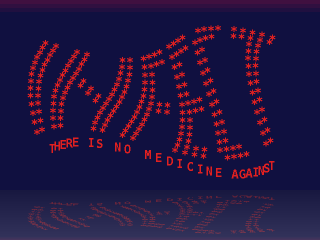

## some small demo effects created using Java Graphics2D

This repository contains my remakes of some demo effects from home computers of the 80s and 90s. AMIGA !!!

Currently there is not much to see here - I've just started this little project...

### Sine Flag

The INFECT "sine wave flag" effect was originally coded by Marley/Infect in 1992. It's an Amiga bootblock (boot sector) intro, which means that its size must be less than 1024 bytes.

Recently Spiv/Infect created a remake of this effect in HTML + Javascript, which can be found [here (infect-rules.de)](https://www.infect-rules.de/2021/08/17/infect-bootblock-wave-html-version/)

This inspired me to write my own version in Java, which looks like this:

### more to be added sometime ...

Copyright (C) 2022  Michael Henke (Smack/Infect)

